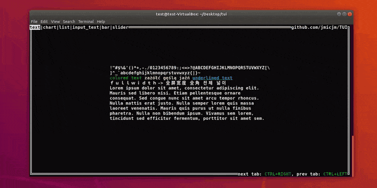

# Terminal user interface library


[source of this example](https://github.com/jmicjm/TUI/blob/master/examples/readme_example.cpp), stripped example(first tab only) below:
```c++
#include "tui.h"

int main()
{
	//box widget with {0x,0y} {100%x, 100%y} size
	tui::box main_box({ {0,0}, {100,100} });
	main_box.setTitle("github.com/jmicjm/TUI");
	main_box.setTitlePosition(tui::POSITION::END);

	//text widget with {0x,0y} {50%x, 50%y} size
	tui::text text({ {0,0}, {50,50} });
	//{0x,0y} {0%x,0%y} offset, origin{x,y} at center
	text.setPositionInfo({ {0,0}, {0,0}, {tui::POSITION::CENTER, tui::POSITION::CENTER} });
	tui::symbol_string str;
	for (char i = 33; i < 127; i++) { str.push_back(i); }
	str << tui::COLOR::GREEN << "\ncolored text " << tui::COLOR::YELLOW << u8"zażółć gęślą jaźń "
		<< tui::ATTRIBUTE::UNDERSCORE << tui::COLOR::CYAN << "underlined text";
	str += u8"\nｆｕｌｌｗｉｄｔｈ-> 全屏宽度 全角 전체 넓이";
	str += "\nLorem ipsum dolor sit amet, consectetur adipiscing elit. Mauris sed libero nisi. "
		"Etiam pellentesque ornare consequat. Sed congue nunc sit amet arcu tempor rhoncus. "
		"Nulla mattis erat justo. Nulla semper lorem quis massa laoreet venenatis. "
		"Mauris quis purus ut nulla finibus pharetra. Nulla non bibendum ipsum. "
		"Vivamus sem lorem, tincidunt sed efficitur fermentum, porttitor sit amet sem.";
	text.setText(str);
	//activated widget will handle user input, in full example activation/deactivation is handled by tui::navigation_group
	text.activate();

	tui::init();

	while (!tui::input::isKeyPressed(tui::input::KEY::ESC))
	{
		tui::output::clear();//clears buffer and resizes it to terminal size

		tui::output::draw(main_box);//copies widget to buffer
		tui::output::draw(text);

		tui::output::display();//displays buffer content
	}

	return 0;
}
```

## Features
* cross-platform(*NIX and Windows)
* easy positioning and sizing
* unicode support
  * utf-8
  * basic data type contains single grapheme cluster
  * fullwidth forms support
 * RGB color support
 
 ## Table of contents
 1. Basic data types 
    * rgb
    * color
    * symbol
    * symbol_string
    * surface
    * surface1D<horizontal/vertical>
2. IO
    * initialization
    * output
    * input
3. Widgets
    * bar<horizontal/vertical>
    * box
    * button<horizontal/vertical>
    * chart
    * input_text
    * line<horizontal/vertical>
    * line_input
    * list
      * drop_list
    * radio_button<horizontal/vertical>
    * rectangle
    * scroll<horizontal/vertical>
    * slider<horizontal/vertical>
    * tabs<horizontal/vertical>
    * text
4. Compatibility
    * system
      * platform specific dependencies
    * terminal
5. Compiling
6. Documentation
    
## 1. Basic data types

### [rgb](https://jmicjm.github.io/TUI/html/structtui_1_1rgb.html)
Represents red, green and blue color channels
```c++
#include "tui_color.h"
tui::rgb rgb(r,g,b);
```
There are also 16 predefined constants inside ```tui::COLOR``` namespace

### [color](https://jmicjm.github.io/TUI/html/structtui_1_1color.html)
Represents foreground and background colors
```c++
#include "tui_color.h"
tui::color color(rgb foreground, rgb background);
```

### [symbol](https://jmicjm.github.io/TUI/html/structtui_1_1symbol.html)
Represents single [grapheme cluster](https://unicode.org/reports/tr29/#Grapheme_Cluster_Boundaries) + color + underline  
Its designed to avoid allocation for small clusters
```c++
#include "tui_symbol.h"
tui::symbol a = 'a';
tui::symbol b = U"\x1100\x1161\x11A8"; //"각" combined from three distinct code points: "ᄀ" + "ᅡ" + "ᆨ"
a.setColor(color c);
a.setUnderscore(bool);
```

### [symbol_string](https://jmicjm.github.io/TUI/html/structtui_1_1symbol__string.html)
String of symbols
```c++
#include "tui_symbol_string.h"
tui::symbol_string str = "abcdefgh";
str << tui::COLOR::RED << "red text";
```

### [surface](https://jmicjm.github.io/TUI/html/structtui_1_1surface.html)
Represents 2D array of symbols. Its size and position are controlled by ```tui::surface_size``` and ```tui::surface_position```/```tui::anchor_position``` members
```c++
#include "tui_surface.h"

tui::surface surface; //creates surface with 1x1 size

surface.setSizeInfo(tui::surface_size({x,y}, {x%,y%})); // {x,y} + {x%,y%} size
//{x,y} offset + {x%,y%} offset , relative to relative_x/y_pos(eg {tui::POSITION::BEGIN, tui::POSITION::CENTER})
surface.setPositionInfo(tui::surface_position({x,y}, {x%,y%}, {relative_x_pos, relative_y_pos}));

surface[x][y] = 'a';// sets symbol at position {x,y}
surface.setSymbolAt('a', {x,y});//same as above
```
[examples](https://github.com/jmicjm/TUI/tree/master/examples/basic)

### [surface1D<horizontal/vertical>](https://jmicjm.github.io/TUI/html/structtui_1_1surface1_d.html)
Acts as an overlay on top of surface. Its size is controlled by ```tui::surface1D_size```
```c++
#include "tui_surface.h"

tui::surface1D<tui::DIRECTION::HORIZONTAL> h_surface;
tui::surface1D<tui::DIRECTION::VERTICAL> v_surface;
```

## 2. IO
```c++
#include "tui_io.h"
```
### initialization
Initialization is performed by
```c++
tui::init();
```
It launches input buffer, hides cursor and sets terminal to raw mode

Restoration to original state is performed by
```c++
tui::restore();
```
It stops input buffer, displays cursor and sets terminal to cooked mode  
It is automatically called at the exit of program, so there is no need to call it unless you want to use standard input/output methods

### output
Remember to call ```tui::init()``` before using following functions
```c++
//output loop
while(/**/)
{
tui::output::clear();
tui::output::draw(surface);
tui::output::display();
}
```

### input
Non-alphanumeric keys(arrows, F-keys etc) values are stored in enum ```tui::input::KEY```

Remember to call ```tui::init()``` before using following functions  

```tui::input::getInput();``` returns ```std::vector<short>``` with pressed keys  
```tui::input::getStringInput();``` returns ```std::string``` with pressed keys(alphanumeric only)  
```tui::input::getRawInput();``` returns ```std::string``` with uninterpreted input, equivalent to calling ```getchar()``` in loop  
```tui::input::isKeyPressed(short key);``` returns amount of key press  
```tui::input::isKeySupported(short key);``` returns true if key is supported by terminal  
```tui::input::getKeyName(short key);``` returns ```std::string``` with key name  

## 3. Widgets
### [bar<horizontal/vertical>](https://jmicjm.github.io/TUI/html/structtui_1_1bar.html)
### [box](https://jmicjm.github.io/TUI/html/structtui_1_1box.html)
### [button<horizontal/vertical>](https://jmicjm.github.io/TUI/html/structtui_1_1button.html)
### [chart](https://jmicjm.github.io/TUI/html/structtui_1_1chart.html)
### [input_text](https://jmicjm.github.io/TUI/html/structtui_1_1input__text.html)
### [line<horizontal/vertical>](https://jmicjm.github.io/TUI/html/structtui_1_1line.html)
### [line_input](https://jmicjm.github.io/TUI/html/structtui_1_1line__input.html)
### [list](https://jmicjm.github.io/TUI/html/structtui_1_1list.html)
### [drop_list](https://jmicjm.github.io/TUI/html/structtui_1_1drop__list.html)
### [radio_button<horizontal/vertical>](https://jmicjm.github.io/TUI/html/structtui_1_1radio__button.html)
### [rectangle](https://jmicjm.github.io/TUI/html/structtui_1_1rectangle.html)
### [scroll<horizontal/vertical>](https://jmicjm.github.io/TUI/html/structtui_1_1scroll.html)
### [slider<horizontal/vertical>](https://jmicjm.github.io/TUI/html/structtui_1_1slider.html)
### [tabs<horizontal/vertical>](https://jmicjm.github.io/TUI/html/structtui_1_1tabs.html)
### [text](https://jmicjm.github.io/TUI/html/structtui_1_1text.html)

## 4. Compatibility
### system
Should work on most UNIX-like and Windows systems  
I personally tested it on few linux distributions, freeBSD and Windows10/7
##### platform specific dependencies
*NIX:  
```termios.h```  
```unistd.h ```  
```sys/ioctl.h```  
Windows:  
```windows.h```  
```conio.h```  
Platform dependent code is located in these files: ```src/tui_input.cpp```, ```src/tui_output.cpp```, ```src/tui_terminal_info.cpp```  
Checks for following defines : ```_WIN32```, ```__unix__```,```__linux__```

### terminal
*NIX:  
Retrieves key sequences and cursor related sequences from  ```infocmp``` output  
Checks ```$COLORTERM``` for ```"truecolor"```  
Windows:  
Uses predefined key sequences

In absence of RGB color automatically map colors to 4bit rgbi

## 5. Compiling
g++:  
```
g++ file.cpp path_to_src/*.cpp -Ipath_to_src -pthread -std=c++14
```

## 6. Documentation
[Doxygen](https://jmicjm.github.io/TUI/html/index.html)
